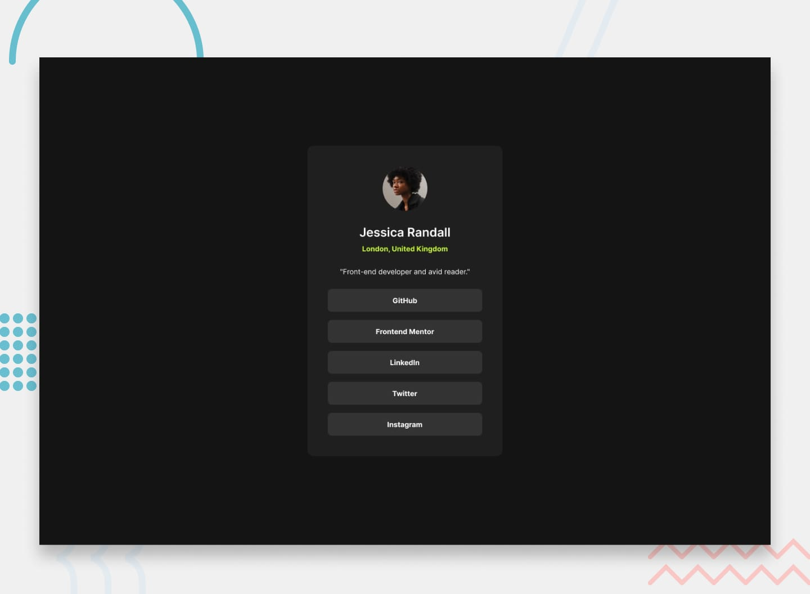

🌐 Social Links Profile

A responsive Social Links Profile Card built as part of a Frontend Mentor challenge.
The project focuses on creating a clean profile layout with interactive social media buttons using HTML and CSS.

🚀 Features

- Profile card layout
- Social media link buttons
- Hover and focus states for interactive elements
- Clean typography and spacing
- Responsive centered layout
- Minimal modern UI

| Technology       | Purpose                 |
| ---------------- | ----------------------- |
| **HTML5**        | Semantic page structure |
| **CSS3**         | Styling and layout      |
| **Flexbox**      | Centering and alignment |
| **GitHub Pages** | Deployment              |

📸 Screenshot

